# S.O. 2025.1 - Atividade 04 - Prática de escalonamento de tarefas
## Aluna: Emanuelly Karine Fernandes dos Santos
## Data: 29/05/2025

# Objetivo do exercício

Explorar o comportamento de diferentes tipos de threads (CPU-bound e I/O-bound) em sistemas Linux utilizando containers Docker.

# Passos Executados
## 1. Código inicial

- Iniciamos criando uma pasta no sistema chamada "docker-c-practice" e criando dentro um arquivo Dockerfile e outro chamando threads_cpu_io.c.
- O arquivo threads_cpu_io.c utiliza dois conceitos utilizando threads: CPU-bound - tarefas intensas de processamento; e I/O-bound - tarefas com espera simulada (sleep).
- Código do arquivo Dockerfile.

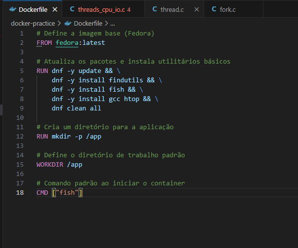

- Código do arquivo threads_cpu_io.c.

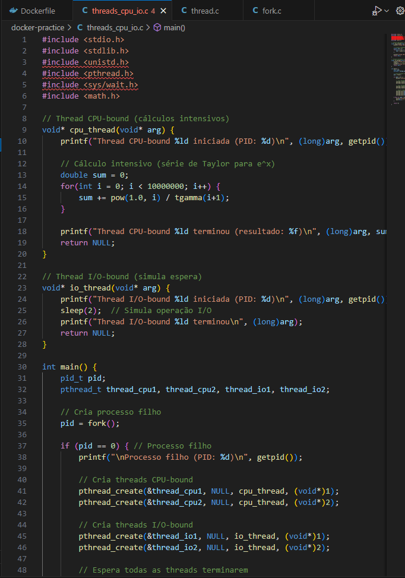

## 2. Criar imagem
- Utilizei o comando "docker build -t fedora-sistemas-opracionais ." para criar a imagem fedora para realizar os testes.

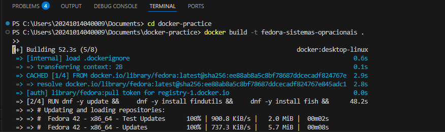

## 3. Compilação e execução
- Executei o meu container docker com fedora utilizando o comando "docker run -it --name escalonamento -v "${PWD}:/app" fedora-sistemas-operacionais fish".

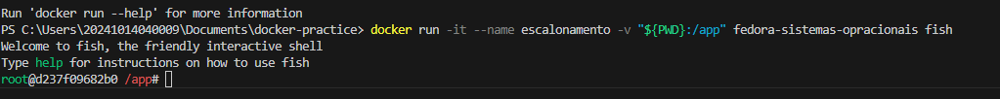

- Após isso compilei e executei meu arquivo "threads_cpu_io.c" no primeiro terminal que abri rodando o docker run.

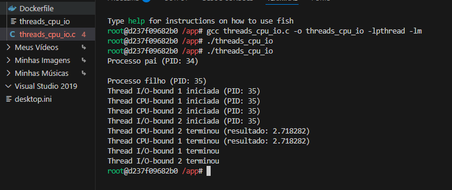

- Nesse terminal rodei o docker exec.

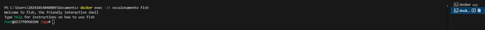

- E nele executei o comando "top -H -p $(pgrep threads_cpu_io)".

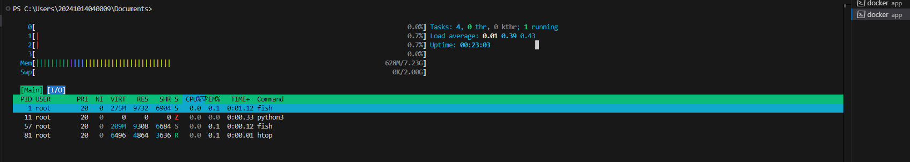
  
## 4. Tarefa
- Nessa etapa adicionei mais uma thread de cada tipo CPU-bound e I/O-bound.

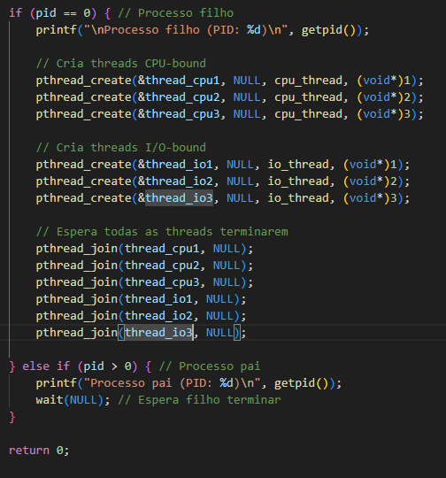
  
- E alterei o cálculo da CPU-bound para utilizar o cálculo de PI.

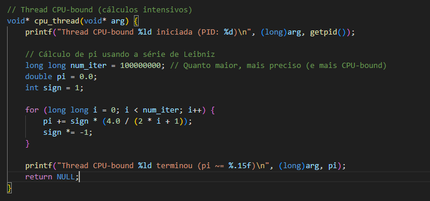

- Fiz a instalação do utilitário "perf" para poder executar o comando posteriormente.

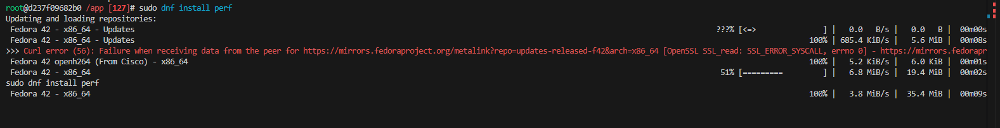

- Executando o comando "perf stat ./threads_cpu_io" para ver o tempo que rodou o arquivo após as modificações.

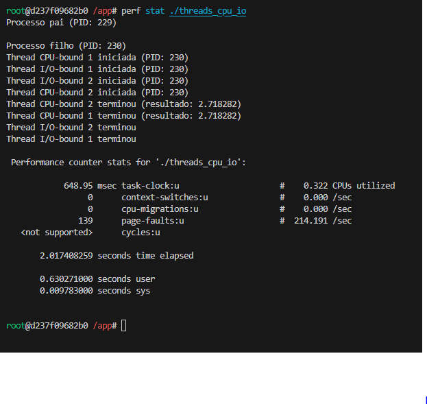 

- Abaixo está o tempo anterior utilizando 2 threads e o antigo cálculo.

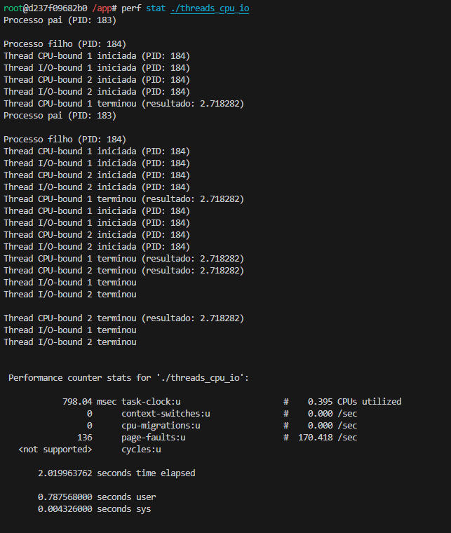

# Resultados Obtidos
- As threads CPU-bound consumiram significativamente mais CPU.
- As threads I/O-bound ficaram grande parte do tempo dormindo (sleep), quase sem uso de CPU.
- O escalonador do sistema permitiu que threads CPU competissem mais ativamente entre si.
- Com o comando perf stat, foi possível ver o número de ciclos e o tempo real/gasto no programa.
  
# Conclusão

A atividade foi útil para visualizar a diferença entre tipos de cargas de trabalho em sistemas operacionais modernos. O uso de ferramentas como htop, top e perf permitiu uma compreensão prática de como o sistema operacional trata o escalonamento de tarefas com diferentes demandas.
